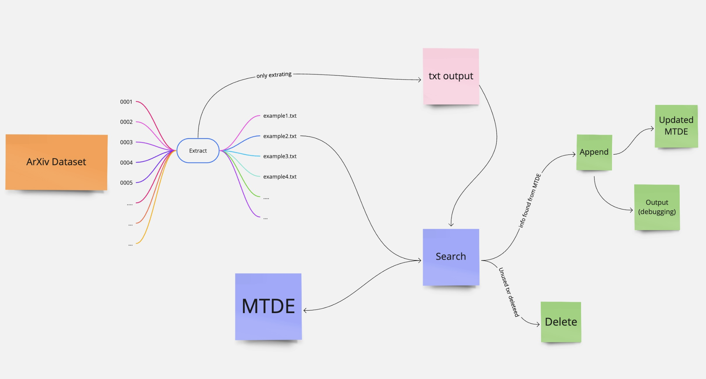

# arXiv-MDTE-key-word-extraction
A python searching engene for extrating and searching source number of elements in MDTE based on the arXiv dataset.

# Directory 
1.Installation and set up\
2.Usage \
3.Reference 

# Installation and set Up
We need the following python package for this project, use the package manager [pip](https://pip.pypa.io/en/stable/) to install them.
```bash
pip install numpy
pip install pandas
pip install urllib3
pip install requests
pip install beautifulsoup4
```

git clone the whole repository for testing or experiment.

```bash
git clone https://github.com/MLPgroup/arXiv-MDTE-key-word-extraction.git
```
ArXiv Dateset: the entire dateset is required in this project, you can also use the search engine to search other datesets with modification of the code path. 

You may download the dataset through the Kaggle: https://www.kaggle.com/datasets/Cornell-University/arxiv

# Usage

To run the searching engine:
```bash
python3 "your path to the file" search.py
```
*NOTE: the extract.py is automaticllt running corresponding to the search.py, if you only want to run extraxct.py:
```bash
python3 "your path to the file" extract.py
```
To delete the scripted txt files:
```bash
python3 "your path to the file" delete.py
```
To append the results to the destination csv file:
```bash
python3 "your path to the file" append.py
```

## Extract
This code is a Python script that scrapes text data from HTML files stored in a specific directory using the BeautifulSoup library. The goal of the script appears is to extract text data from HTML files in order to create text-based datasets for future purposes.

The script begins by importing the required libraries, including Pandas, BeautifulSoup, and requests. The os library is also imported for file system operations. The code then retrieves a list of files in a specified directory using the os.listdir() function.

The script then enters a nested loop, iterating through each file in each subdirectory of the specified directory. For each file, the script opens the file using open() function, reads its contents using the BeautifulSoup library, removes all script and style elements from the HTML using a for loop and the extract() function, and then extracts the text from the remaining HTML using soup.get_text().

The text is then split into lines, chunks, and concatenated together into a single string using various string manipulation functions such as splitlines(), split(), and join(). Finally, the extracted text is written to a text file named "output.txt" in a specified output directory using the open() function.

In summary, this script is designed to extract text data from HTML files and store it in text files for use in machine learning tasks. The script utilizes libraries like Pandas and BeautifulSoup to read and manipulate the HTML files and uses Python's built-in string manipulation functions to extract and process the text data.

## Search
The Search.py file first imports several modules including Pandas, BeautifulSoup, and TQDM, and reads in a CSV file containing two columns of data - "var" and "context". It then uses the "os" module to list all the directories and files within a specific directory.

The first loop goes through each directory within the main directory and the second loop goes through each file within each directory. It opens each file using the BeautifulSoup module, removes all script and style elements, and then extracts the text from the HTML file. It then saves the text to a file with the same name as the original file, but with "output.txt" appended to the end.

After extracting text from all files, the code loops through the output files and compares each line of text with each string in the "context" column of the CSV file. If a match is found, the code prints the string, the line number, and the file name to an output file.

Finally, the code deletes all the output files and moves on to the next directory. The entire process is repeated until all directories have been processed. The output is saved in a file named "test.out".
## Delete
This file is automatically callable by the search file as a purpose of memory saving. The file will delete the output of the extract.py under the list of "/dateset" 
## Append
This file is used to append the information from the output of seaching engine to the desired csv file. In our experiment, we found the source number for the variables of MTDE and expand the dateset with appending source number behind each variable. 

## Overall Dataframe 


# License
* [UIUC-MLP Group] (https://mlpgroup.xyz/) 

* [Campus Cluster Accelerator] (https://campuscluster.illinois.edu/resources/docs/user-guide/)

*NOTE A quick note on using the Campus Cluster is posted here:
https://mlpgroup.xyz/resources/2022-12-21-UsingtheCC
# Reference 
* [MDTE](https://github.com/emhamel/Mathematical-Text-Understanding) \
Paper: [1] Hamel, E., Zheng, H., & Kani, N. (2022). An Evaluation of NLP Methods to Extract Mathematical Token Descriptors. In International Conference on Intelligent Computer Mathematics (pp. 329-343). Springer, Cham.

* Beautiful Soup: https://www.crummy.com/software/BeautifulSoup/bs4/doc/

